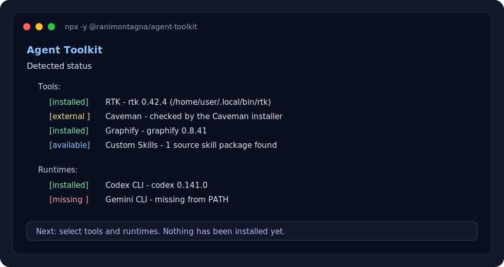
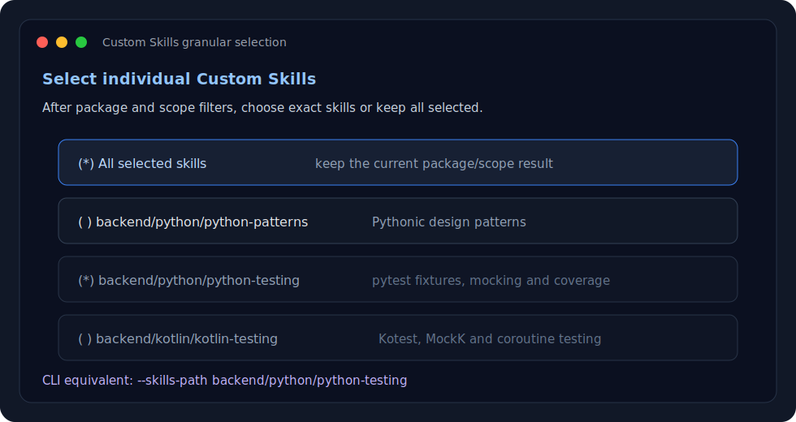
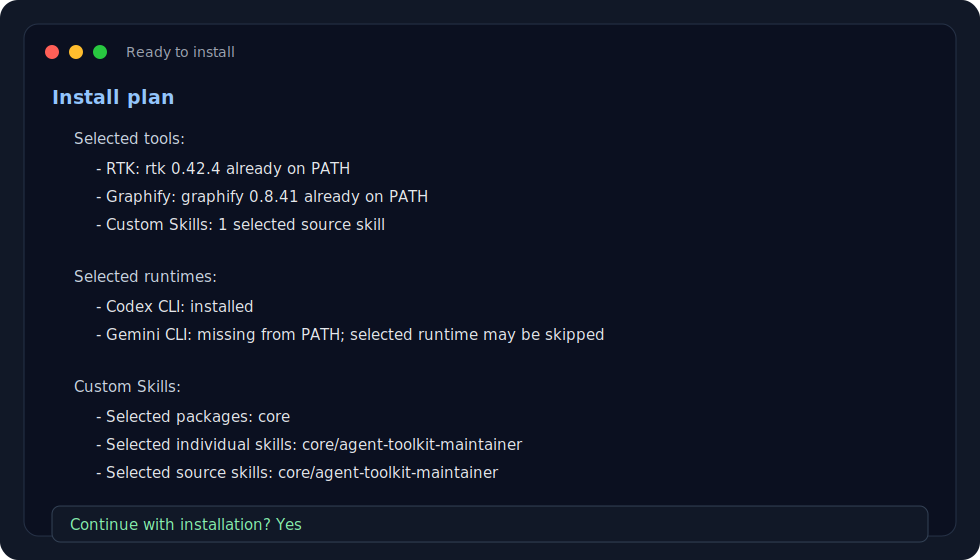

# Agent Toolkit

One command to set up an AI coding-agent workspace across Claude Code, Codex
CLI, OpenCode and Gemini CLI.

```bash
npx -y @ranimontagna/agent-toolkit
```

Agent Toolkit installs the tools and skills I use to run agentic coding
workflows: RTK, Caveman, Superpowers, Graphify, GSD, third-party frontend
skills and bundled Custom Skills.

The installer is a TypeScript CLI published to npm. The Bash script is only a
compatibility wrapper for users who already run `setup-agent-toolkit.sh`.

## Install Flow

Interactive terminals use a Clack menu. The installer first shows what it can
detect locally, then asks what to install, then shows a final plan before doing
any work.



Custom Skills are grouped by first-level package. Today this repository ships
`core`, `backend` and `frontend`; future packages can be added under
`skills/<package>/...` and they will appear automatically in the menu.



The final plan shows selected tools, runtimes, skill packages, scope and already
present skills before installation starts.



## What It Installs

| Area | What it adds |
|---|---|
| RTK | Token-aware shell proxy for coding-agent sessions |
| Caveman | Terse response mode and optional agent integrations |
| Superpowers | Planning, TDD, debugging, review and delivery workflows |
| Graphify | Queryable knowledge graphs for codebases, docs and project context |
| GSD | Phase-based planning, execution, verification and project control |
| Frontend Skills | Third-party design skills installed through Agent Skills CLI |
| Custom Skills | Bundled skills from this repository, selected by package and scope |

## Supported Runtimes

| Runtime | Support |
|---|---|
| Claude Code | Plugins and skills |
| Codex CLI | Plugins, skills and local automation |
| OpenCode | Skills plus package-driven tools |
| Gemini CLI | Extensions and native Agent Skills install |

Superpowers is installed automatically for Claude Code, Codex CLI and Gemini
CLI. OpenCode Superpowers support is not automated yet because the upstream
install flow is not a stable single command.

Caveman, GSD, Frontend Skills and Custom Skills can target Claude Code, Codex
CLI, OpenCode and Gemini CLI. Graphify is installed through the official
`graphifyy` package and registers itself for selected runtimes.

## Quick Commands

Run the interactive installer:

```bash
npx -y @ranimontagna/agent-toolkit
```

Install the full kit for Codex CLI:

```bash
npx -y @ranimontagna/agent-toolkit --all --codex
```

Install the full kit for every supported runtime:

```bash
npx -y @ranimontagna/agent-toolkit --all --all-runtimes
```

Install only Graphify for Codex CLI:

```bash
npx -y @ranimontagna/agent-toolkit --graphify-only --codex
```

Install only third-party frontend design skills for Codex CLI:

```bash
npx -y @ranimontagna/agent-toolkit --frontend-skills-only --codex
```

Install only bundled Custom Skills into the current project:

```bash
npx -y @ranimontagna/agent-toolkit --skills-only --codex --local
```

Install only the `core` Custom Skills package:

```bash
npx -y @ranimontagna/agent-toolkit --skills-only --codex --skills-package core
```

List bundled Custom Skills and their repository scope paths:

```bash
npx -y @ranimontagna/agent-toolkit --skills-list
```

Install missing selected runtime CLIs before configuring them:

```bash
npx -y @ranimontagna/agent-toolkit --all --gemini --install-missing-clis
```

## Custom Skills

Bundled skills live under `skills/`.

```text
skills/
  core/
    agent-toolkit-maintainer/
      SKILL.md
  backend/
    fastify-best-practices/
      SKILL.md
      rules/
    go/
      golang-patterns/
        SKILL.md
      golang-testing/
        SKILL.md
    java/
      java-coding-standards/
        SKILL.md
      java-junit/
        SKILL.md
  frontend/
    react-native/
      react-native-expert/
        SKILL.md
      react-native-unistyles-v3/
        SKILL.md
    react/
      react-patterns/
        SKILL.md
        rules/
      react-performance/
        SKILL.md
        rules/
      react-testing/
        SKILL.md
        rules/
```

The first path segment is a selectable package:

```text
skills/<package>/<optional-scope>/<skill-name>/SKILL.md
```

Runtime installs are flat even when repository paths are nested. For example,
`skills/backend/java/java-junit/SKILL.md` installs as:

```text
~/.codex/skills/java-junit/
```

Use `--skills-package` to select first-level packages:

```bash
npx -y @ranimontagna/agent-toolkit --skills-only --codex --skills-package core
```

Use `--skills-scope` to select a narrower path:

```bash
npx -y @ranimontagna/agent-toolkit --skills-only --codex --skills-scope backend/java
```

Install only React Native skills:

```bash
npx -y @ranimontagna/agent-toolkit --skills-only --codex --skills-scope frontend/react-native
```

Both filters can be combined. The selected package filter runs first, then the
scope filter narrows the result.

```bash
npx -y @ranimontagna/agent-toolkit \
  --skills-only \
  --codex \
  --skills-package backend \
  --skills-scope backend/java
```

Each skill must be a directory containing `SKILL.md` with frontmatter:

```markdown
---
name: my-skill
description: Use when doing a specific kind of task.
---

# My Skill

Follow these steps...
```

### Included Skill Packages

| Package | Skill | Source |
|---|---|---|
| `core` | `agent-toolkit-maintainer` | Maintained in this repository |
| `backend` | `fastify-best-practices` | Copied from Matteo Collina's [`mcollina/skills`](https://github.com/mcollina/skills/tree/main/skills/fastify) under the MIT license |
| `backend` | `golang-patterns` | Copied from Affaan Mustafa's [`ECC`](https://github.com/affaan-m/ECC/tree/main/skills/golang-patterns) under the MIT license |
| `backend` | `golang-testing` | Copied from Affaan Mustafa's [`ECC`](https://github.com/affaan-m/ECC/tree/main/.kiro/skills/golang-testing) under the MIT license |
| `backend` | `java-coding-standards` | Copied from Affaan Mustafa's [`ECC`](https://github.com/affaan-m/ECC/tree/main/skills/java-coding-standards) under the MIT license |
| `backend` | `java-junit` | Copied from GitHub's [`awesome-copilot`](https://github.com/github/awesome-copilot/tree/main/skills/java-junit) under the MIT license |
| `frontend` | `react-native-expert` | Copied from Jeffallan's [`claude-skills`](https://github.com/Jeffallan/claude-skills/tree/main/skills/react-native-expert) under the MIT license |
| `frontend` | `react-native-unistyles-v3` | Copied from Jacek Pudysz's [`react-native-unistyles`](https://github.com/jpudysz/react-native-unistyles/tree/main/skills/react-native-unistyles-v3), declared MIT upstream |
| `frontend` | `react-patterns` | Copied from Affaan Mustafa's [`ECC`](https://github.com/affaan-m/ECC/tree/main/skills/react-patterns) under the MIT license |
| `frontend` | `react-performance` | Copied from Affaan Mustafa's [`ECC`](https://github.com/affaan-m/ECC/tree/main/skills/react-performance) under the MIT license |
| `frontend` | `react-testing` | Copied from Affaan Mustafa's [`ECC`](https://github.com/affaan-m/ECC/tree/main/skills/react-testing) under the MIT license |

Each React skill carries its own ECC `rules/react` references so Markdown links
still resolve after the installer copies skills into flat runtime directories.

The installer validates:

- `SKILL.md` exists;
- frontmatter starts and closes with `---`;
- `name` and `description` are present;
- `name` uses lowercase letters, numbers and hyphens;
- `description` is non-empty and under 1024 characters.

Third-party frontend design skills such as Impeccable and Taste Skill are not
vendored as bundled Custom Skills. The `frontend-skills` tool installs them
externally through the Agent Skills CLI from pinned public sources.

## CLI Reference

```text
Tools:
  --all                  Install every tool without the menu
  --rtk-only             Install only RTK
  --caveman-only         Install only Caveman
  --superpowers-only     Install only Superpowers
  --graphify-only        Install only Graphify
  --gsd-only             Install only GSD
  --frontend-skills-only Install only third-party frontend skills
  --skills-only          Install only Custom Skills
  --no-rtk               Skip RTK
  --no-caveman           Skip Caveman
  --no-superpowers       Skip Superpowers
  --no-graphify          Skip Graphify
  --no-gsd               Skip GSD
  --no-frontend-skills   Skip third-party frontend skills
  --no-skills            Skip Custom Skills

Runtimes:
  --all-runtimes         Target Claude Code, Codex CLI, OpenCode and Gemini CLI
  --claude               Target only Claude Code
  --codex                Target only Codex CLI
  --opencode             Target only OpenCode
  --gemini               Target only Gemini CLI
  --no-claude            Skip Claude Code
  --no-codex             Skip Codex CLI
  --no-opencode          Skip OpenCode
  --no-gemini            Skip Gemini CLI

Install scope:
  --global               Install runtime assets into user config directories
  --local                Install runtime assets into the current project
  --skills-dir DIR       Use another source directory for Custom Skills
  --skills-package NAME  Install Custom Skills from a first-level package
  --skills-scope SCOPE   Install skills under a relative scope path
  --skills-list          List discovered Custom Skills and exit

Other:
  --install-missing-clis Install selected runtime CLIs if missing
  --allow-mutable-sources Allow explicit mutable package sources like @latest
  --help, -h             Show help
```

Repeat `--skills-package` or `--skills-scope` to select more than one filter.

## Configuration

```text
RTK_INSTALL_DIR       RTK binary install directory
CAVEMAN_PACKAGE       Caveman package source
CAVEMAN_MODE          minimal or all
GRAPHIFY_PACKAGE      Python package used to install Graphify
GRAPHIFY_INSTALLER    uv or pipx
GSD_PACKAGE           GSD package source
SKILLS_CLI_PACKAGE    npm package used for third-party skill installs
GSD_SCOPE             global or local
TOOLS_LOCK_PATH       External tool provenance lock path
ALLOW_MUTABLE_SOURCES Set to 1 to allow mutable source overrides
AGENT_TOOLKIT_MENU    Set to plain to force the line-based interactive menu
CUSTOM_SKILLS_DIR     Source directory for Custom Skills
SKILLS_PACKAGE        Comma-separated first-level skill package filters
SKILLS_SCOPE          Comma-separated skill scope filters
CLAUDE_CLI_PACKAGE    npm package used to install Claude Code CLI
CODEX_CLI_PACKAGE     npm package used to install Codex CLI
OPENCODE_CLI_PACKAGE  npm package used to install OpenCode CLI
GEMINI_CLI_PACKAGE    npm package used to install Gemini CLI
```

Defaults come from `tools.lock.json`:

```text
CAVEMAN_PACKAGE=github:JuliusBrussee/caveman#655b7d9c5431f822264b7732e9901c5578ac84cf
GRAPHIFY_PACKAGE=graphifyy==0.8.31
GRAPHIFY_INSTALLER=uv
GSD_PACKAGE=get-shit-done-cc@1.42.3
SKILLS_CLI_PACKAGE=skills@1.5.10
CLAUDE_CLI_PACKAGE=@anthropic-ai/claude-code@2.1.162
CODEX_CLI_PACKAGE=@openai/codex@0.137.0
OPENCODE_CLI_PACKAGE=opencode-ai@1.15.13
GEMINI_CLI_PACKAGE=@google/gemini-cli@0.45.0
```

Mutable overrides like `@latest`, unpinned npm packages or GitHub package
sources without a full commit SHA are blocked unless you pass
`--allow-mutable-sources` or set `ALLOW_MUTABLE_SOURCES=1`.

## Security Model

This project has two supply-chain boundaries:

- repository dependencies, controlled by `pnpm-lock.yaml`, CI, `pnpm audit`,
  pnpm supply-chain policies and npm release provenance;
- external tools installed by the runtime installer, controlled by
  `tools.lock.json` and runtime provenance validation.

Repository installs are configured in `pnpm-workspace.yaml` to delay newly
published package versions for 24 hours, enforce that delay strictly, reject
missing registry publish timestamps, block transitive exotic package sources and
fail trust downgrades for packages that previously had stronger publish
evidence.

Current external sources:

| Tool | Locked source | Runtime verification |
|---|---|---|
| RTK | GitHub release `rtk-ai/rtk@v0.42.1` | Verifies the selected asset SHA-256 before extraction |
| Caveman | `JuliusBrussee/caveman` at commit `655b7d9c5431f822264b7732e9901c5578ac84cf` | Immutable GitHub npm spec |
| Graphify | `graphifyy==0.8.31` | Blocks unpinned package overrides |
| GSD | `get-shit-done-cc@1.42.3` | Blocks `@latest` unless explicitly allowed |
| Frontend Skills | `skills@1.5.10`, `pbakaus/impeccable` and `Leonxlnx/taste-skill` at pinned commits | Clones pinned refs before install |
| Runtime CLIs | Exact npm versions for Claude, Codex, OpenCode and Gemini | Used only when `--install-missing-clis` is enabled |

Bundled third-party skills preserve upstream attribution and license files:

| Skill | Source commit | License |
|---|---|---|
| `fastify-best-practices` | `mcollina/skills@5b2a81354b6d10325da0db9decc9ce5ecc714138` | MIT |
| `react-native-expert` | `Jeffallan/claude-skills@e8be415bc94d8d6ebddc2fb50e5d03c6e27d4319` | MIT |
| `react-native-unistyles-v3` | `jpudysz/react-native-unistyles@8b5e9fd281a81bdfd87d4fe9e6a0b042c84c5c83` | MIT |
| `react-patterns` | `affaan-m/ECC@0f84c0e2796703fbda87d577b2636351418c7442` | MIT |
| `react-performance` | `affaan-m/ECC@0f84c0e2796703fbda87d577b2636351418c7442` | MIT |
| `react-testing` | `affaan-m/ECC@0f84c0e2796703fbda87d577b2636351418c7442` | MIT |

Releases use npm trusted publishing through GitHub Actions OIDC. The npm
package is published without a long-lived npm token, and npm automatically
generates provenance for public packages published through trusted publishing.

## Repository Layout

```text
bin/
  agent-toolkit.ts       Thin TypeScript entrypoint
.github/
  workflows/
    ci.yml               Quality and security gates
    release.yml          Trusted publishing release workflow
src/
  main.ts                Installer orchestration
  args.ts                CLI flag parsing
  menu.ts                Interactive selection
  status.ts              Local install status detection
  runtimes.ts            Runtime CLI checks
  skills.ts              Recursive skill discovery and installation
  installers/            Tool-specific installers
dist/
  bin/
    agent-toolkit.js     Compiled CLI used by npm and the wrapper
docs/
  assets/                README terminal screenshots
skills/
  core/
    agent-toolkit-maintainer/
      SKILL.md
  backend/
    fastify-best-practices/
      SKILL.md
      rules/
  frontend/
    react-native/
    react/
tests/
  unit/
  test-agent-toolkit.sh
AGENTS.md                Shared project rules for coding agents
CLAUDE.md                Pointer to AGENTS.md for Claude Code
pnpm-lock.yaml           Repository dependency lockfile
pnpm-workspace.yaml      pnpm workspace and supply-chain policy settings
setup-agent-toolkit.sh   Bash compatibility wrapper
tools.lock.json          Pinned external tool sources and RTK checksums
```

## Development

Prerequisites:

- Node.js 22+ for the full toolkit;
- `npx` for Caveman, GSD and third-party frontend skills;
- `git` for pinned third-party frontend skill sources;
- `pnpm` 11.x for repository development;
- `npm` when using `--install-missing-clis` or publishing through npm trusted
  publishing;
- `uv` for Graphify, or `pipx` when `GRAPHIFY_INSTALLER=pipx`;
- `tar` or `unzip` only when RTK needs to be downloaded;
- runtime CLIs you want to target: `claude`, `codex`, `opencode`, `gemini`.

Install dependencies and build from a clone:

```bash
pnpm install
pnpm run build
bash setup-agent-toolkit.sh
```

Run the local Node CLI directly:

```bash
node dist/bin/agent-toolkit.js
```

Quality scripts:

```bash
pnpm run build
pnpm run typecheck
pnpm run lint
pnpm run lint:fix
pnpm run format
pnpm run security
pnpm run test:unit
pnpm run test:integration
pnpm test
pnpm run check
```

`pnpm run check` is the release gate. It runs lint, typecheck, unit tests, build,
compiled JavaScript syntax checks, Bash syntax checks and the shell integration
test.

The shell integration test validates the wrapper, flags, fake runtime CLIs,
installer command wiring, skill discovery and public-safe reference checks.

## CI And Release

GitHub Actions runs:

- `Check`: lint, typecheck, unit tests, build and integration tests;
- `Secret scan`: Gitleaks over full Git history;
- `Dependency audit`: `pnpm install --frozen-lockfile --ignore-scripts` and
  `pnpm audit`;
- `Dependency review`: blocks PRs that add moderate-or-higher vulnerable
  dependencies.

Release a new npm version by updating `package.json`, pushing the change to
`main`, then pushing a matching tag:

```bash
git tag v0.1.7
git push origin v0.1.7
```

The `Release` workflow runs the full check and publishes the scoped package to
npm through trusted publishing. Dependency install and checks use pnpm, but the
final publish step intentionally stays on `npm publish` because npm trusted
publishing OIDC is handled by the npm CLI. Configure the npm package trusted
publisher for GitHub Actions with workflow filename `release.yml` before
pushing a release tag.

## Maintenance Rules

Keep this repository public-safe:

- do not add company-specific URLs, tokens, secrets or internal project names;
- keep third-party skills on pinned public sources, and only vendor them when
  the license permits copying and the repository preserves attribution;
- keep the installer idempotent;
- keep `tools.lock.json` as the source of truth for external tool versions;
- cover pure module behavior with Vitest;
- keep the shell integration test around behavior that can regress;
- document what is automatic and what still depends on each runtime CLI.
