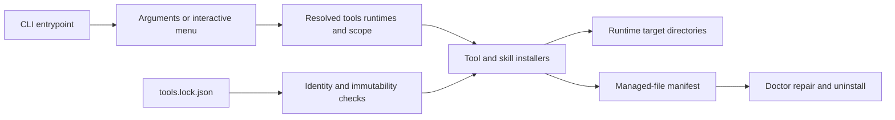

<!-- generated-by: gsd-doc-writer -->

# Architecture

## System Overview

Agent Toolkit is a layered Node.js command-line installer that turns command-line arguments, interactive answers, environment-backed defaults, and an immutable-by-default external-source catalog into a resolved set of tools, runtimes, and install scope. A central orchestrator validates provenance and prerequisites, delegates work to tool-specific adapters, copies supported skills into runtime-specific targets, records the Custom Skill paths it manages, and reports human-readable status with JSON available for supported read-only operations. The project is intentionally adapter-based: selection and policy remain in shared modules, while installers own the commands required by each external tool.

## Component and Data Flow



The installed commands declared in [`package.json`](../package.json) resolve to the generated `dist/bin/agent-toolkit.js` artifact. Its authoring source is [`bin/agent-toolkit.ts`](../bin/agent-toolkit.ts), which calls `runInstaller()` and converts expected `InstallerError` failures into a concise error and nonzero process exit.

A normal invocation follows this path:

1. Importing [`src/state.ts`](../src/state.ts) loads and validates [`tools.lock.json`](../tools.lock.json), combines locked values with supported environment overrides, and initializes the singleton selection state. [`src/args.ts`](../src/args.ts) then applies command-line selectors and operation flags. `--all` selects the default tool set but explicitly leaves Agent Browser disabled; Agent Browser requires its separate opt-in selector.
2. Read-only operations such as skill listing, catalog auditing, lock-update reporting, and Doctor return early. Otherwise, [`src/menu.ts`](../src/menu.ts) collects tools, runtimes, scope, optional runtime CLI installation, and Custom Skill filters when no noninteractive selector was supplied. The menu's “All tools” choice also excludes Agent Browser.
3. The orchestrator requires at least one tool and runtime. Manifest-backed uninstall and dry-run branch before installation. A normal dry-run checks provenance, detects current state, prints the resolved plan, and performs no prerequisites, installs, copies, or manifest writes. An uninstall dry-run validates and reports matching manifest entries without deleting paths or rewriting the manifest.
4. A real install checks selected external-source identity and mutability, prints the selection, and asks [`src/runtimes.ts`](../src/runtimes.ts) to validate prerequisites and optionally install or update selected runtime CLIs.
5. [`src/main.ts`](../src/main.ts) dispatches selected installers in a fixed order: RTK, Caveman, Superpowers, Graphify, GSD, Improve, Agent Browser, Frontend Skills, Planning Skills, and Custom Skills. Each adapter returns success or failure; nonfatal failures are accumulated so independent later installers can still run.
6. Successful Custom Skill copies call `recordSkillInstall()`. At the end of dispatch, [`src/manifest.ts`](../src/manifest.ts) writes any pending manifest atomically, the UI prints the final scope and source summary, and any accumulated failure sets `process.exitCode` to `1`. Fatal validation errors propagate to the CLI boundary and terminate immediately.

## Module Map

The top-level `src/` modules each have one primary responsibility:

| Module | Responsibility |
|---|---|
| [`args.ts`](../src/args.ts) | Parse flags into the shared selection and operation state. |
| [`checksum.ts`](../src/checksum.ts) | Compute and compare SHA-256 file digests. |
| [`context.ts`](../src/context.ts) | Resolve the package root and user home in source and compiled layouts. |
| [`doctor.ts`](../src/doctor.ts) | Build and format read-only health reports from detected status. |
| [`lock-update.ts`](../src/lock-update.ts) | Compare current source pins with upstream candidates without changing the lock. |
| [`logger.ts`](../src/logger.ts) | Provide consistent status output and the expected installer error type. |
| [`main.ts`](../src/main.ts) | Orchestrate selection, lifecycle branches, validation, installer dispatch, manifest persistence, and exit status. |
| [`manifest.ts`](../src/manifest.ts) | Validate, update, atomically persist, and safely uninstall recorded Custom Skill destinations. |
| [`menu.ts`](../src/menu.ts) | Resolve interactive, plain-text, or piped selections into shared state. |
| [`provenance.ts`](../src/provenance.ts) | Enforce locked source identity, immutability, and Antigravity installer URL policy. |
| [`release.ts`](../src/release.ts) | Prepare version commits and tags after validating local and optional remote Git state. |
| [`runtimes.ts`](../src/runtimes.ts) | Map runtime names to commands, adapter arguments, prerequisite checks, and optional CLI installation. |
| [`skill-targets.ts`](../src/skill-targets.ts) | Resolve global or project-local skill roots for each supported runtime. |
| [`skills-audit.ts`](../src/skills-audit.ts) | Validate bundled Custom Skill metadata and local links. |
| [`skills.ts`](../src/skills.ts) | Discover, filter, validate, copy, and record Custom Skills. |
| [`state.ts`](../src/state.ts) | Define tool/runtime names and hold the lock-backed mutable invocation state. |
| [`status.ts`](../src/status.ts) | Detect installed or available tools and runtimes and format the install plan. |
| [`system.ts`](../src/system.ts) | Wrap command execution, command lookup, and bounded HTTP fetch/download behavior. |
| [`tool-lock.ts`](../src/tool-lock.ts) | Define and validate the external-tool lock and Agent Skills catalog schema. |
| [`ui.ts`](../src/ui.ts) | Render the install header, resolved selections, and final summary. |
| [`usage.ts`](../src/usage.ts) | Own public CLI help text. |

Tool-specific side effects live behind installer adapters:

| Installer | Responsibility |
|---|---|
| [`installers/agent-browser.ts`](../src/installers/agent-browser.ts) | Install the pinned Agent Browser package, provision Chrome for Testing, and install its catalog skill. |
| [`installers/agent-skills.ts`](../src/installers/agent-skills.ts) | Fetch catalog repositories at pinned commits, contain skill roots, and invoke the pinned Agent Skills CLI. |
| [`installers/caveman.ts`](../src/installers/caveman.ts) | Delegate selected supported runtimes to the pinned Caveman package. |
| [`installers/graphify.ts`](../src/installers/graphify.ts) | Install the pinned Python package and invoke supported runtime integration commands. |
| [`installers/gsd.ts`](../src/installers/gsd.ts) | Delegate selected supported runtimes and scope to the pinned GSD package. |
| [`installers/rtk.ts`](../src/installers/rtk.ts) | Select, download, verify, install, and initialize the platform-specific RTK binary. |
| [`installers/superpowers.ts`](../src/installers/superpowers.ts) | Invoke each supported runtime's native plugin or extension command. |

## Catalog and Provenance Boundary

[`tools.lock.json`](../tools.lock.json) is the source of truth for external tool identity. [`loadToolLock()`](../src/tool-lock.ts) rejects unsupported schema versions, mutable package versions, non-full Git refs, invalid SHA-256 values, unknown bundle IDs, unsafe relative catalog paths, and bundle entries that reference unknown repositories. The Agent Skills section separates repository identity from bundle metadata: repository records pin upstream projects to full commits, while bundle records provide the label, description, skill name, and optional repository-relative path. Status derives bundle counts and source details from the catalog; [`installAgentSkillBundle()`](../src/installers/agent-skills.ts) consumes the metadata and entries to perform installation.

Before dry-run, Doctor, or real installation, [`checkExternalToolProvenance()`](../src/provenance.ts) compares selected override identities with the locked package, repository, or release identity and rejects mutable sources by default. Alternate lock files, re-identified sources, mutable versions, and a non-default Antigravity installer are allowed only through the explicit mutable-source override; the Antigravity script must still be an HTTPS URL without embedded credentials. This opt-in changes provenance policy for that invocation rather than modifying the catalog.

The Agent Skills installer clones each referenced repository once into a temporary directory, fetches the pinned commit, checks out detached `FETCH_HEAD`, and verifies that `HEAD` exactly matches the lock. Before invoking the Agent Skills CLI, it resolves both checkout and requested skill roots and rejects a path that is not a directory contained by the checkout. External Agent Skills bundles use the catalog and their own installer, but they are not entered into the managed-file manifest.

## Runtime and Target Boundary

The canonical runtime names are Claude Code, Codex CLI, OpenCode, Gemini CLI, and Antigravity. [`runtimeMeta`](../src/state.ts) maps them to command names and display labels; [`src/runtimes.ts`](../src/runtimes.ts) translates the selection into each external installer's argument vocabulary. Selection is intentionally broader than adapter support: an adapter that cannot automate a selected runtime warns and skips that integration rather than inventing a target.

For local scope, [`resolveSkillTargetDirs()`](../src/skill-targets.ts) makes every Custom Skill destination project-relative to the invocation directory:

| Runtime | Local Custom Skill root |
|---|---|
| Claude Code | `.claude/skills/` |
| Codex CLI | `.codex/skills/` |
| OpenCode | `.opencode/skills/` |
| Gemini CLI | `.gemini/skills/` |
| Antigravity | `.agents/skills/` |

Global scope resolves roots from supported runtime-specific environment variables or user configuration defaults. Antigravity can mirror a Custom Skill into both its current and legacy global roots. The target resolver is shared by installation and uninstall validation so lifecycle operations agree on the allowed destination boundary.

## Manifest and Lifecycle Boundary

The versioned manifest tracks only Custom Skills copied by [`src/skills.ts`](../src/skills.ts), including Custom Skills selected from an alternate `--skills-dir` source. It does not track external Agent Skills bundles, tool packages, runtime CLIs, plugins, extensions, or RTK binaries. Each entry records a runtime, source, absolute destination, and installation timestamp; local and global scopes use separate manifests below the project or user `.agent-toolkit/` directory.

Custom Skill copying uses a sibling temporary directory and rename for each destination. Manifest entries are upserted by absolute destination and held in memory until dispatch finishes. Persistence writes formatted JSON to a sibling `.tmp` file and renames it over the manifest, so consumers do not observe a partially written document.

Doctor is read-only: it combines current detection with the resolved selection and reports missing tools, runtimes, or skills. Repair re-runs selected installers; only successful Custom Skill copies refresh managed entries. Uninstall reads the recorded paths instead of scanning runtime directories. Before removal, it validates the complete manifest, selected runtimes, current scope, recognized skill roots, direct-child relationship, canonical containment, and filesystem identity. A separate Node subprocess rechecks root and destination identity, renames the destination to a same-root random tombstone, rechecks containment, and only then removes it. A missing recorded destination can be pruned from the manifest, while an identity or containment failure preserves the manifest for manual review or retry.

## Transport and Filesystem Security

The main trust controls are deliberately split across layers:

- [`src/tool-lock.ts`](../src/tool-lock.ts) validates pinned version, ref, checksum, catalog, and relative-path formats before state can consume them.
- [`src/provenance.ts`](../src/provenance.ts) gates selected runtime values and environment overrides against those identities before side effects.
- [`src/system.ts`](../src/system.ts) limits a request to five redirects and a 30-second total deadline, caps JSON responses at 5 MiB and downloads at 512 MiB by default, enforces both declared and streamed sizes, and rejects redirects from HTTPS to a non-HTTPS protocol. Downloads go to a unique exclusive partial file and are renamed only after a complete response; failed partials are removed.
- [`src/installers/rtk.ts`](../src/installers/rtk.ts) verifies the selected archive against the per-platform SHA-256 value in the lock before extraction or installation.
- [`src/installers/agent-skills.ts`](../src/installers/agent-skills.ts) verifies fetched commit identity and canonical skill-root containment before handing a path to an external CLI.
- [`src/skills.ts`](../src/skills.ts) prevents directory creation through a file path and stages Custom Skill copies before replacement.
- [`src/manifest.ts`](../src/manifest.ts) combines lexical checks, real paths, direct-child containment, `lstat` identities, same-root renames, and identity rechecks to defend uninstall against traversal, symlink escape, and time-of-check/time-of-use substitution.

These controls protect the toolkit's own download, copy, and recorded-path lifecycle boundaries. External package managers and runtime-native plugin commands remain responsible for the internals of the third-party packages they execute.

## CI and Release Architecture

[`CI`](../.github/workflows/ci.yml) runs for pushes to `main` and pull requests targeting `main`. On Node.js 24 it installs the locked pnpm dependencies and runs the full `pnpm run check` gate. Separate jobs scan Git history for secrets, audit dependencies without lifecycle scripts, and review dependency changes on pull requests.

[`src/release.ts`](../src/release.ts) is the local preparation boundary. It requires the repository root, `main`, a clean tree, and a new local tag; push mode additionally requires `main` to track `origin/main`, checks divergence and remote tag absence, then uses an atomic push for the release commit and tag. Unless explicitly bypassed, it runs the full check before creating the Conventional Commit and tag.

[`Release`](../.github/workflows/release.yml) is triggered by `v*` tags. The Node.js 24 publish job installs frozen dependencies, reruns the full check, requires the tag name to equal `v` plus the package version, and verifies that the tagged commit is an ancestor of `origin/main`. Workflow permissions are limited to read-only repository contents and OIDC `id-token: write`; [`scripts/publish-npm-with-retry.sh`](../scripts/publish-npm-with-retry.sh) publishes the public package with npm provenance and verifies publication across bounded retries. Operational release and recovery steps belong in [Deployment and Releases](DEPLOYMENT.md).

## Key Abstractions

| Abstraction | Role |
|---|---|
| [`ToolName`, `RuntimeName`, and `state`](../src/state.ts) | Canonical selection vocabulary and the resolved invocation state. |
| [`ToolLock`, `AgentSkillRepository`, and `AgentSkillBundle`](../src/tool-lock.ts) | Validated external identity and third-party skill catalog contract. |
| [`InstallerStatus` and `Detection`](../src/status.ts) | Shared current-state model for menus, plans, and Doctor. |
| [`BundleInstallResult`](../src/installers/agent-skills.ts) | Per-skill installed, failed, or blocked outcomes for catalog bundles. |
| [`SkillTargetContext`](../src/skill-targets.ts) | Explicit scope, working directory, home, and environment used to resolve allowed roots. |
| [`InstallManifest` and `ManifestEntry`](../src/manifest.ts) | Versioned ownership record for managed Custom Skill destinations. |
| [`DoctorReport`](../src/doctor.ts) | Stable human- or JSON-renderable health report. |
| [`RunResult` and `HttpRequestOptions`](../src/system.ts) | Process and transport results shared by installers and release code. |
| [`ReleaseExecutionContext`](../src/release.ts) | Injectable repository root and command runner used by release validation and tests. |

## Directory Structure Rationale

```text
bin/                 TypeScript CLI entrypoint
src/                 Shared selection, policy, lifecycle, and orchestration modules
src/installers/      Tool-specific side-effect adapters
skills/              Bundled Custom Skill source tree
scripts/             Build cleanup and npm publication helpers
tests/               Unit and end-to-end shell verification
docs/                Public guides and retained project design records
.github/workflows/    CI, security, and tag-driven publication boundaries
dist/                Generated JavaScript package output; never an authoring source
```

Root configuration files define the package, TypeScript build, formatter/linter, tests, and pinned dependencies. Keeping external commands in `src/installers/` prevents tool-specific invocation details from leaking into selection and lifecycle policy, while the shared target, manifest, provenance, and system modules give every adapter the same safety boundaries.
