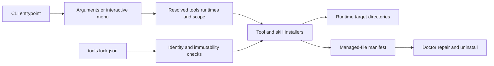

# Repository Documentation Refresh Implementation Plan

> **For agentic workers:** REQUIRED SUB-SKILL: Use superpowers:subagent-driven-development (recommended) or superpowers:executing-plans to implement this plan task-by-task. Steps use checkbox (`- [ ]`) syntax for tracking.

**Goal:** Replace the monolithic repository documentation with an accurate,
layered documentation set and a complete, evidence-backed history for all 33
Git tags through `v0.2.0`.

**Architecture:** Keep `README.md` as the concise product entry point and move
operational depth into focused guides under `docs/`. Treat `CHANGELOG.md` as a
separate release-history artifact reconstructed from tag ranges and npm
metadata. Use the GSD documentation work manifest to track every canonical and
hand-written document, then verify all claims against source, tests, workflows,
Git, and npm before delivery.

**Tech Stack:** Markdown, Node.js 24, pnpm 11.8.0, TypeScript source evidence,
Git tags, npm registry metadata, GitHub Actions, Biome, Vitest, Bash integration
tests, Gitleaks.

## Global Constraints

- Write all public documentation in English.
- Preserve Node.js support as `>=24` and pnpm as `11.8.0`.
- Do not add a documentation-site framework or hosted docs deployment.
- Do not change installer behavior, release behavior, public APIs, package
  metadata, tests, or workflows as part of this documentation refresh.
- Preserve `docs/superpowers/` as historical design and implementation evidence;
  do not rewrite it as current operational guidance.
- Describe exactly 33 Git tags: `v0.1.0` through `v0.1.31`, plus `v0.2.0`.
- Mark `v0.1.0` and `v0.1.8` as tag-only; the other 31 versions were published
  to npm.
- State that this repository currently uses Git tags and GitHub Actions rather
  than GitHub Release objects for publication.
- Keep external sources immutable by default and explain that source-identity
  overrides require `--allow-mutable-sources`.
- Keep examples public-safe: no machine-local absolute paths, private names,
  private URLs, credentials, tokens, or copied environment values.
- Use `rtk` before project commands when available and Conventional Commits for
  every commit.

---

## File Structure

| File | Action | Responsibility |
|---|---|---|
| `README.md` | Rewrite | Concise product landing page, quick install, supported tools and runtimes, tested external-source summary, and guide navigation. |
| `CHANGELOG.md` | Rewrite | Milestones and one evidence-backed entry for every Git tag. |
| `CONTRIBUTING.md` | Update | Short contribution policy that routes workflow details to canonical guides. |
| `SECURITY.md` | Update | Reporting policy, trust boundaries, and links to security/configuration detail. |
| `docs/GETTING-STARTED.md` | Create | End-to-end first installation, selection, dry-run, Doctor, repair, and uninstall journey. |
| `docs/ARCHITECTURE.md` | Create | Installer execution model, catalogs, provenance, runtime targets, manifest lifecycle, security boundaries, and release path. |
| `docs/CONFIGURATION.md` | Create | Complete flags, environment variables, precedence, scopes, and target-path reference. |
| `docs/DEVELOPMENT.md` | Create | Local setup, module ownership, safe change workflow, contribution flow, and release preparation. |
| `docs/TESTING.md` | Create | Quality gates, individual commands, test layout, failure interpretation, and CI mapping. |
| `docs/DEPLOYMENT.md` | Create | Release preflights, version bump, atomic push, GitHub Actions, trusted npm publishing, retries, and post-release checks. |
| `.planning/tmp/docs-work-manifest.json` | Create, update, then remove | Temporary GSD workflow source of truth; never commit it. |

### Documentation ownership

- `README.md`: orientation and navigation only, except for source details that
  are enforced by `tests/test-agent-toolkit.sh`.
- `docs/GETTING-STARTED.md`: user journey and copyable examples.
- `docs/CONFIGURATION.md`: exhaustive option and environment reference.
- `docs/ARCHITECTURE.md`: internal relationships and trust boundaries.
- `docs/DEVELOPMENT.md` and `docs/TESTING.md`: maintainer workflow and gates.
- `docs/DEPLOYMENT.md`: release and npm publication mechanics.
- `CHANGELOG.md`: version-to-version differences.
- `CONTRIBUTING.md` and `SECURITY.md`: concise policy.

---

### Task 1: Initialize the documentation work manifest

**Files:**
- Create temporarily: `.planning/tmp/docs-work-manifest.json`
- Read: `README.md`
- Read: `CHANGELOG.md`
- Read: `CONTRIBUTING.md`
- Read: `SECURITY.md`
- Read: `AGENTS.md`
- Read: `CLAUDE.md`
- Read: `docs/superpowers/plans/*.md`
- Read: `docs/superpowers/specs/*.md`

**Interfaces:**
- Consumes: approved design at
  `docs/superpowers/specs/2026-07-14-repository-documentation-design.md` and
  `docs-init` project detection.
- Produces: the complete canonical, review, and gap queues used by every later
  task.

- [ ] **Step 1: Refresh project detection**

Run:

```bash
node "$HOME/.codex/gsd-core/bin/gsd-tools.cjs" query docs-init
```

Expected: CLI package detected; open-source and tests are `true`; API routes
are `false`; README, changelog, contribution, security, agent instructions, and
historical documents appear in `existing_docs`.

- [ ] **Step 2: Create the work manifest with exact canonical modes**

Create the manifest using these canonical entries:

```json
{
  "canonical_queue": [
    {"type":"readme","resolved_path":"README.md","mode":"update","preservation_mode":"regenerate","wave":1,"status":"pending"},
    {"type":"architecture","resolved_path":"docs/ARCHITECTURE.md","mode":"create","preservation_mode":null,"wave":1,"status":"pending"},
    {"type":"configuration","resolved_path":"docs/CONFIGURATION.md","mode":"create","preservation_mode":null,"wave":1,"status":"pending"},
    {"type":"getting_started","resolved_path":"docs/GETTING-STARTED.md","mode":"create","preservation_mode":null,"wave":2,"status":"pending"},
    {"type":"development","resolved_path":"docs/DEVELOPMENT.md","mode":"create","preservation_mode":null,"wave":2,"status":"pending"},
    {"type":"testing","resolved_path":"docs/TESTING.md","mode":"create","preservation_mode":null,"wave":2,"status":"pending"},
    {"type":"deployment","resolved_path":"docs/DEPLOYMENT.md","mode":"create","preservation_mode":null,"wave":2,"status":"pending"},
    {"type":"contributing","resolved_path":"CONTRIBUTING.md","mode":"update","preservation_mode":"supplement","wave":2,"status":"pending"}
  ],
  "review_queue": [],
  "gap_queue": [],
  "created_at": "2026-07-14T20:42:58Z"
}
```

Populate `review_queue` with `AGENTS.md`, `CLAUDE.md`, `CHANGELOG.md`,
`SECURITY.md`, and every Markdown file under `docs/superpowers/plans/` and
`docs/superpowers/specs/`. Use `pending_review` for each status. The historical
documents are checked for broken paths and accidental sensitive content, but
historical descriptions are not converted into current behavior.

- [ ] **Step 3: Confirm there are no additional documentation gaps**

Inspect the top-level modules in `src/`, `src/installers/`, `scripts/`,
`.github/workflows/`, and `tests/`. Record an empty `gap_queue` because the
approved canonical guides cover the CLI, installer modules, source provenance,
runtime targets, lifecycle, development, testing, security, and publishing.

- [ ] **Step 4: Validate the manifest before editing docs**

Run:

```bash
node -e 'const m=require("./.planning/tmp/docs-work-manifest.json"); if(m.canonical_queue.length!==8||m.review_queue.length<4||m.gap_queue.length!==0) process.exit(1); console.log("manifest ok")'
```

Expected: `manifest ok`.

Do not commit the temporary manifest.

---

### Task 2: Reconstruct the complete release history

**Files:**
- Modify: `CHANGELOG.md`
- Read: `package.json`
- Read: `tools.lock.json`
- Read: `.github/workflows/release.yml`
- Read: `src/release.ts`
- Read: `scripts/publish-npm-with-retry.sh`

**Interfaces:**
- Consumes: all tag ranges, tag creation dates, npm publication timestamps, and
  the existing changelog.
- Produces: the canonical version history linked by README and deployment docs.

- [ ] **Step 1: Capture the authoritative release inventory**

Run:

```bash
git for-each-ref --sort=version:refname --format='%(refname:short)|%(creatordate:short)|%(objectname:short)' refs/tags
npm view @ranimontagna/agent-toolkit time --json
```

Expected: 33 tags; npm timestamps for 31 versions; no npm timestamps for
`0.1.0` or `0.1.8`.

- [ ] **Step 2: Replace the changelog introduction and add the milestone table**

Use these five milestone rows:

| Milestone | Versions | Meaningful evolution |
|---|---|---|
| Foundation | `0.1.0`–`0.1.16` | Hardened installer foundation, interactive selection, bundled language/workflow skills, granular skill selection, Graphify workflow, and Antigravity runtime. |
| Toolkit expansion | `0.1.17`–`0.1.22` | Improve, GSAP, toolkit operations, strict review, revenue/design workflows, and official GSD integration. |
| Lifecycle hardening | `0.1.23`–`0.1.26` | React Doctor, safer uninstall/repair, pinned-source enforcement, Windows support, redirect checks, provenance, and Graphify 0.9.11. |
| Onboarding and catalog growth | `0.1.27`–`0.1.31` | Planning skills, Web Design Guidelines, repository onboarding, multi-runtime guidance, Agent Browser, and Remotion skills. |
| Catalog-driven release | `0.2.0` | Normalized agent-skill catalog plus bounded HTTP, release, Antigravity, manifest, and publication hardening. |

Explain directly below the table that release entries are based on Git tag
ranges and npm metadata, and that publication uses tags plus GitHub Actions,
not GitHub Release objects.

- [ ] **Step 3: Write one newest-first entry for every tag**

Use the heading format `## [0.2.0] - 2026-07-14` and include a status line of
either `Published to npm` or `Git tag only — not published to npm`. Consolidate
each version to one through four user-relevant bullets using this exact content
map:

| Version | Date | Status | Differences to describe |
|---|---|---|---|
| `0.2.0` | 2026-07-14 | npm | Catalog-driven agent-skill metadata and installer; containment of skill roots; bounded HTTP requests; hardened release state, publish retries, Antigravity environment handling, and manifest uninstall paths. |
| `0.1.31` | 2026-07-12 | npm | Agent Browser and Remotion skills; stabilized custom-skill fixtures; ignored local worktrees. |
| `0.1.30` | 2026-07-11 | npm | Correct multi-runtime flag guidance for `onboard-repo`. |
| `0.1.29` | 2026-07-11 | npm | Bundled `onboard-repo` skill for stack detection, matching skill installation, and agent-doc organization. |
| `0.1.28` | 2026-07-11 | npm | Replaced Taste Skill with Vercel Web Design Guidelines to complement Impeccable. |
| `0.1.27` | 2026-07-11 | npm | Added pinned planning skills from Matt Pocock: grilling variants and domain modeling. |
| `0.1.26` | 2026-07-09 | npm | Updated Graphify from `0.8.51` to `0.9.11`. |
| `0.1.25` | 2026-07-09 | npm | Required explicit permission for source-identity overrides and alternate locks; enforced HTTPS for Antigravity override scripts; restored Windows npm/RTK execution; added RTK download/checksum integration coverage. |
| `0.1.24` | 2026-07-09 | npm | Made uninstall dry-run non-destructive; fixed exact runtime-version matching and failure propagation; verified pinned checkouts and redirect safety; added npm provenance; strengthened repair behavior; reduced package size and declared Node engines. |
| `0.1.23` | 2026-07-09 | npm | Added pinned React Doctor integration; generalized frontend-skill installation; corrected RTK hook wiring; improved EACCES and flag-override guidance; stabilized tests. |
| `0.1.22` | 2026-07-08 | npm | Switched to official `@opengsd/gsd-core`; fixed macOS integration tests; rejected target paths that are files. |
| `0.1.21` | 2026-07-04 | npm | Added the complete design-to-code lifecycle; hardened it through dogfood; added interaction, responsive, multi-screen, consolidation, and anti-drift guidance. |
| `0.1.20` | 2026-07-02 | npm | Added the revenue-centric design skill. |
| `0.1.19` | 2026-06-28 | npm | Refreshed toolkit pins and bundled skills. |
| `0.1.18` | 2026-06-19 | npm | Added toolkit operation commands and the thermonuclear code-quality review skill. |
| `0.1.17` | 2026-06-18 | npm | Added pinned Improve installation and GSAP skills; refreshed source/runtime pins; published through trusted npm release flow. |
| `0.1.16` | 2026-06-07 | npm | Added Antigravity as a supported runtime. |
| `0.1.15` | 2026-06-04 | npm | Documented Graphify workflow and handled macOS install drift. |
| `0.1.14` | 2026-06-04 | npm | Consolidated the custom-skill refinement prompt. |
| `0.1.13` | 2026-06-04 | npm | Streamlined custom-skill prompts. |
| `0.1.12` | 2026-06-04 | npm | Removed a secret-scan false positive from the API skill. |
| `0.1.11` | 2026-06-04 | npm | Added API-design and Astro skills. |
| `0.1.10` | 2026-06-04 | npm | Added package, scope, and exact-path skill selection. |
| `0.1.9` | 2026-06-04 | npm | Added Python and Kotlin skill packages. |
| `0.1.8` | 2026-06-04 | tag only | Added bundled workflow skills. |
| `0.1.7` | 2026-06-04 | npm | Added Java and Go skill packages. |
| `0.1.6` | 2026-06-04 | npm | Added React frontend skill packages. |
| `0.1.5` | 2026-06-04 | npm | Improved onboarding, migrated to pnpm, and added Fastify skills. |
| `0.1.4` | 2026-06-04 | npm | Added bundled-skill package selection and npm trusted publishing. |
| `0.1.3` | 2026-06-04 | npm | Displayed installer status before installation. |
| `0.1.2` | 2026-06-04 | npm | Added the visual installer menu. |
| `0.1.1` | 2026-06-04 | npm | Corrected the npm account scope. |
| `0.1.0` | 2026-06-04 | tag only | Established the installer, project rules, CI/security gates, immutable provenance, frontend-skill installer, and npm release workflow. |

- [ ] **Step 4: Add deterministic tag and comparison links**

Link `0.1.0` to
`https://github.com/raniellimontagna/agent-toolkit/tree/v0.1.0`. For every later
entry, add a `Compare` link using
`https://github.com/raniellimontagna/agent-toolkit/compare/vPREVIOUS...vCURRENT`.
Do not link to nonexistent GitHub Release pages.

- [ ] **Step 5: Validate completeness and ordering**

Run a Node comparison that extracts changelog versions, strips the leading `v`
from `git tag --sort=-version:refname`, and fails unless both arrays are
identical. Then verify status counts:

```bash
rg -c "Published to npm" CHANGELOG.md
rg -c "Git tag only" CHANGELOG.md
```

Expected: 31 npm entries and 2 tag-only entries.

- [ ] **Step 6: Commit the release history**

```bash
git add CHANGELOG.md
git commit -m "docs: reconstruct complete release history"
```

---

### Task 3: Rewrite the product landing page and getting-started journey

**Files:**
- Modify: `README.md`
- Create: `docs/GETTING-STARTED.md`
- Read: `src/usage.ts`
- Read: `src/args.ts`
- Read: `src/menu.ts`
- Read: `src/doctor.ts`
- Read: `src/manifest.ts`
- Read: `src/tool-lock.ts`
- Read: `tests/test-agent-toolkit.sh`

**Interfaces:**
- Consumes: current CLI help, lifecycle behavior, catalog metadata, and
  integration-test README assertions.
- Produces: the repository entry point and first-use guide linked by every
  policy and operational document.

- [ ] **Step 1: Rewrite README as a concise landing page**

Use these sections in order:

1. `Agent Toolkit` — one-paragraph purpose and badges only if already valid.
2. `Quick Start` — Node.js 24 prerequisite and the tested command
   `npx -y @ranimontagna/agent-toolkit --all --codex`.
3. `Choose Tools and Runtimes` — concise table for the default tool set,
   Agent Browser's explicit opt-in, and the five runtimes.
4. `Safe Lifecycle Operations` — dry-run, Doctor/status, JSON output, repair,
   uninstall, lock update, and skill audit examples.
5. `Current External Sources` — preserve the exact marker
   `Current external sources:` and end marker `Bundled third-party skills preserve upstream attribution`.
6. `Documentation` — links to all six guides plus changelog, contributing, and security.
7. `Development and Releases` — only the shortest local gate and release
   pointers, linking to detailed guides.

Keep the integration-test-required strings `React Doctor`,
`millionco/react-doctor`, `Remotion Best Practices`, `remotion-dev/skills`,
`Modified MIT License`, and `agent skill integration, not automatic CI setup`.
Inside the external-source marker range, keep every bundle ID and skill name
from `tools.lock.json.tools.agentSkills.bundles`.

- [ ] **Step 2: Create the complete first-use guide**

Write `docs/GETTING-STARTED.md` with:

- prerequisites: Node.js 24+, npm/npx, supported platforms, and optional
  runtime CLIs;
- interactive install through `npx` and local checkout through
  `bash setup-agent-toolkit.sh`;
- tool selection, runtime selection, `--global` versus `--local`, and the rule
  that bare `--claude`, `--codex`, `--opencode`, `--gemini`, and
  `--antigravity` selectors are mutually exclusive;
- the correct multi-runtime form
  `--all-runtimes --no-gemini --no-antigravity`;
- package, scope, and exact-path custom-skill examples;
- `--dry-run` before mutation and `--doctor --json` after installation;
- what the manifest records, how `--repair` refreshes it, and how `--uninstall`
  removes only recorded, contained paths;
- common problems: missing runtime CLIs, npm EACCES, Graphify installer choice,
  target path already being a file, and immutable-source rejection;
- next links to configuration, architecture, testing, security, and changelog.

- [ ] **Step 3: Verify README's tested contract before running the suite**

Run the same string assertions used by `tests/test-agent-toolkit.sh`, including
the one-command install and all external-source/catalog values. Expected: every
string and catalog item is found in `README.md`.

- [ ] **Step 4: Verify local Markdown links in both files**

For every Markdown link whose target is neither `http`, `https`, `mailto`, nor
an in-page anchor, resolve the target relative to its document and confirm it
exists. Expected: zero missing paths.

- [ ] **Step 5: Run focused verification**

```bash
rtk pnpm run lint
rtk pnpm run test:integration
```

Expected: both commands pass, including README catalog assertions.

- [ ] **Step 6: Commit the entry-point documentation**

```bash
git add README.md docs/GETTING-STARTED.md
git commit -m "docs: add layered onboarding guides"
```

---

### Task 4: Document the system architecture

**Files:**
- Create: `docs/ARCHITECTURE.md`
- Read: `src/main.ts`
- Read: `src/args.ts`
- Read: `src/state.ts`
- Read: `src/menu.ts`
- Read: `src/tool-lock.ts`
- Read: `src/provenance.ts`
- Read: `src/installers/*.ts`
- Read: `src/runtimes.ts`
- Read: `src/skill-targets.ts`
- Read: `src/manifest.ts`
- Read: `src/release.ts`
- Read: `.github/workflows/ci.yml`
- Read: `.github/workflows/release.yml`

**Interfaces:**
- Consumes: source-level module and data-flow evidence.
- Produces: the internal model referenced by configuration, development,
  testing, deployment, contributing, and security docs.

- [ ] **Step 1: Write the architecture overview and module map**

Document the execution chain from `dist/bin/agent-toolkit.js` to `src/main.ts`,
argument parsing/state, menu or noninteractive selection, installer dispatch,
runtime targeting, manifest update, and final status. Map each top-level source
module to one clear responsibility without describing generated `dist/` files
as authoring sources.

- [ ] **Step 2: Add a small data-flow diagram**

Use a Mermaid flow with these exact conceptual nodes:



Explain that Agent Browser is excluded from `--all`, external sources are
pinned, catalog entries drive third-party agent-skill metadata, and local
runtime targets are project-relative.

- [ ] **Step 3: Document trust and lifecycle boundaries**

Cover checksum verification, pinned package/ref/version identity, opt-in
mutable sources, HTTPS downgrade rejection, bounded HTTP size/time, path
containment, symlink defenses, atomic manifest writes, dry-run semantics, and
recorded-path uninstall. Keep claims tied to source links.

- [ ] **Step 4: Document CI and release architecture at a summary level**

Show `main`/pull-request CI, tagged release workflow, Node.js 24, full `check`,
tag-to-package-version validation, tag ancestry on `main`, OIDC permissions,
and npm provenance. Link operational steps to `docs/DEPLOYMENT.md` instead of
duplicating commands.

- [ ] **Step 5: Validate all source links and terminology**

Expected: every referenced path exists; runtime names are exactly Claude Code,
Codex CLI, OpenCode, Gemini CLI, and Antigravity; no claim suggests Agent
Browser is installed by `--all`.

- [ ] **Step 6: Commit the architecture guide**

```bash
git add docs/ARCHITECTURE.md
git commit -m "docs: document toolkit architecture"
```

---

### Task 5: Build the exhaustive configuration reference

**Files:**
- Create: `docs/CONFIGURATION.md`
- Read: `src/usage.ts`
- Read: `src/args.ts`
- Read: `src/state.ts`
- Read: `src/skill-targets.ts`
- Read: `src/tool-lock.ts`
- Read: `src/provenance.ts`
- Read: `src/installers/graphify.ts`
- Read: `src/logger.ts`

**Interfaces:**
- Consumes: accepted CLI flags, environment reads, defaults, and validation.
- Produces: the sole exhaustive configuration reference.

- [ ] **Step 1: Document flag precedence before the tables**

State these rules:

- the last bare `--*-only` tool selector wins and emits an override warning;
- the last bare runtime selector wins and emits an override warning;
- use `--all` plus `--no-<tool>` for multiple tools;
- use `--all-runtimes` plus `--no-<runtime>` for multiple runtimes;
- explicit CLI scope overrides `GSD_SCOPE` where applicable;
- repeated package, scope, and path selectors accumulate;
- `--plan-only` aliases `--dry-run`, and `--status` aliases `--doctor`;
- `--json` applies only to supported operations.

- [ ] **Step 2: Add complete CLI tables**

Transcribe every flag from `src/usage.ts` into five tables: Tools, Runtimes,
Install Scope and Skill Filters, Operations, and Other. Preserve repeatability,
aliases, default exclusions, and required arguments. Do not invent short flags
other than `-h`.

- [ ] **Step 3: Add complete environment-variable tables**

Document the 24 public variables listed by `src/usage.ts`, plus these
source-supported integration variables in a separate table:

- `CLAUDE_CONFIG_DIR`, `CODEX_HOME`, `OPENCODE_CONFIG_DIR`,
  `OPENCODE_CONFIG`, `XDG_CONFIG_HOME`, and `GEMINI_CONFIG_DIR` for global
  runtime targets;
- `UV_TOOL_BIN_DIR` and `PIPX_BIN_DIR` for Graphify executable discovery;
- `NO_COLOR` for plain logs;
- `SKILLS_PACKAGES` and `SKILLS_PATHS` as compatibility aliases used only when
  their singular counterparts are absent.

For every variable, document purpose, accepted form, default source, and
whether changing it can alter source identity. Never copy the current machine's
environment values.

- [ ] **Step 4: Add the runtime target matrix**

Document both scopes:

| Runtime | Local target | Default global target |
|---|---|---|
| Claude Code | `.claude/skills` | `~/.claude/skills` |
| Codex CLI | `.codex/skills` | `~/.codex/skills` |
| OpenCode | `.opencode/skills` | `~/.config/opencode/skills` |
| Gemini CLI | `.gemini/skills` | `~/.gemini/skills` |
| Antigravity | `.agents/skills` | `~/.gemini/antigravity-cli/skills` and legacy `~/.agents/skills` |

Explain OpenCode's `OPENCODE_CONFIG_DIR` → directory of `OPENCODE_CONFIG` →
`XDG_CONFIG_HOME/opencode` → default precedence, and Antigravity target
deduplication.

- [ ] **Step 5: Add safe configuration examples**

Include examples for plain menu mode, Graphify through pipx, local skill scope,
multiple skill packages, custom target directories, and an explicit mutable
source override. Label mutable overrides as expert-only and explain that
`TOOLS_LOCK_PATH` and source-identity changes require permission.

- [ ] **Step 6: Verify the reference against source**

Extract all long flags from `src/usage.ts` and assert each appears in
`docs/CONFIGURATION.md`. Extract all environment labels from the `Environment:`
help block and assert each appears. Separately check the integration variables
listed in Step 3.

- [ ] **Step 7: Commit the configuration guide**

```bash
git add docs/CONFIGURATION.md
git commit -m "docs: add configuration reference"
```

---

### Task 6: Document development and testing workflows

**Files:**
- Create: `docs/DEVELOPMENT.md`
- Create: `docs/TESTING.md`
- Read: `package.json`
- Read: `tsconfig.json`
- Read: `tsconfig.test.json`
- Read: `biome.json`
- Read: `tests/unit/*.test.ts`
- Read: `tests/test-agent-toolkit.sh`
- Read: `tests/publish-npm-with-retry.test.sh`
- Read: `.github/workflows/ci.yml`

**Interfaces:**
- Consumes: package scripts, module layout, test suites, and CI jobs.
- Produces: reproducible maintainer setup and quality-gate documentation.

- [ ] **Step 1: Create the development guide**

Include:

- Node.js 24+, Corepack, and pinned pnpm 11.8.0 setup;
- `rtk pnpm install --frozen-lockfile` for reproducible dependency install;
- TypeScript authoring in `src/`, CLI entrypoints, installer modules, bundled
  `skills/`, source locks, scripts, and test ownership;
- a change matrix: CLI flags update `args.ts`, `usage.ts`, tests, and docs;
  external sources update `tools.lock.json`, provenance/installers, tests, and
  docs; runtime support updates state, targets, runtime installer, tests, and
  docs; bundled skills update skill content, audit expectations, and catalog as
  applicable;
- public-safe and immutable-source rules;
- Conventional Commit examples from `AGENTS.md`;
- the focused-test-first workflow followed by the full gate;
- links to architecture, configuration, testing, deployment, contributing, and
  security.

- [ ] **Step 2: Create the testing guide with a script-to-proof matrix**

Document these commands and exact meanings:

| Command | What it proves |
|---|---|
| `rtk pnpm run lint` | Biome formatting and static lint rules. |
| `rtk pnpm run typecheck` | Test-aware TypeScript compilation without output. |
| `rtk pnpm run test:unit` | Vitest behavior for arguments, installers, provenance, lifecycle, releases, networking, targets, and catalogs. |
| `rtk pnpm run build` | Clean production TypeScript build. |
| `rtk pnpm run test:integration` | Built CLI, shell wrapper, README contracts, install flows, and npm publish retry script. |
| `rtk pnpm test` | Unit plus integration suites. |
| `rtk pnpm run check` | Full local release gate: lint, typecheck, unit, build, JS syntax, shell syntax, and integration. |
| `rtk pnpm run security` | Dependency audit at moderate severity or higher. |

Explain CI's `Check`, `Secret scan`, `Dependency audit`, and pull-request-only
`Dependency review` jobs. Include the known principle for timing-sensitive
network tests: isolate the failing test to diagnose, but require a clean full
rerun before delivery; never hide a failure by deleting or skipping the test.

- [ ] **Step 3: Validate every documented command**

Compare every `pnpm run` command in both guides with `package.json.scripts`.
Expected: no unknown script names and no missing core gate.

- [ ] **Step 4: Run the documentation-only minimum gate**

```bash
rtk pnpm run lint
rtk pnpm test
```

Expected: both pass.

- [ ] **Step 5: Commit development and testing docs**

```bash
git add docs/DEVELOPMENT.md docs/TESTING.md
git commit -m "docs: document development and testing"
```

---

### Task 7: Document release and npm publication

**Files:**
- Create: `docs/DEPLOYMENT.md`
- Read: `src/release.ts`
- Read: `.github/workflows/release.yml`
- Read: `scripts/publish-npm-with-retry.sh`
- Read: `tests/unit/release.test.ts`
- Read: `tests/publish-npm-with-retry.test.sh`
- Read: `package.json`

**Interfaces:**
- Consumes: local release helper, tagged GitHub workflow, and retrying npm
  publisher behavior.
- Produces: the operational release guide referenced from README, changelog,
  development, and security docs.

- [ ] **Step 1: Document release prerequisites and version choice**

State that releases must start on clean `main`; `main` must track
`origin/main`; with `--push`, local `main` must not be behind; the next local
and remote tag must not exist; commits must follow Conventional Commits; and
`patch`, `minor`, or `major` controls semver. Explain that `--no-check` exists
but should only be used when the same commit has already passed the full gate.

- [ ] **Step 2: Document the preferred atomic release command**

Use:

```bash
rtk pnpm run release:patch -- --push
```

Explain that the helper builds itself, validates repository state, bumps
`package.json`, updates matching README tag examples if present, runs
`pnpm run check`, creates `chore: release X.Y.Z`, creates `vX.Y.Z`, and pushes
`main` plus the tag atomically. Include minor and major variants without
showing a stale literal version.

- [ ] **Step 3: Document the GitHub Actions and npm path**

Explain tag trigger `v*`, checkout with full history, Node.js 24, frozen pnpm
install, full checks, tag/package-version equality, tag ancestry on
`origin/main`, OIDC `id-token: write`, `npm publish --provenance --access public`,
and no long-lived npm token in the workflow.

- [ ] **Step 4: Document retries and post-release verification**

Describe defaults of three publish attempts and 30 seconds of base delay,
linear backoff, registry recheck after a failed response, idempotent success
when the exact version already exists, and validation of
`PUBLISH_MAX_ATTEMPTS` and `PUBLISH_RETRY_DELAY_SECONDS`. Finish with checks for
Git tag, GitHub Actions result, `npm view @ranimontagna/agent-toolkit@X.Y.Z`,
provenance, and a smoke `npx` help invocation.

- [ ] **Step 5: Distinguish tags, npm versions, and GitHub Releases**

State that the current project has Git tags and npm publications but no GitHub
Release objects. Link release differences to `CHANGELOG.md`.

- [ ] **Step 6: Verify all release claims against source and workflow**

Expected: every command, preflight, permission, retry default, and publication
flag has a corresponding line in `src/release.ts`, `.github/workflows/release.yml`,
or `scripts/publish-npm-with-retry.sh`.

- [ ] **Step 7: Commit the deployment guide**

```bash
git add docs/DEPLOYMENT.md
git commit -m "docs: document release deployment flow"
```

---

### Task 8: Tighten contribution and security policies

**Files:**
- Modify: `CONTRIBUTING.md`
- Modify: `SECURITY.md`
- Review: `AGENTS.md`
- Review: `CLAUDE.md`
- Review: `docs/superpowers/plans/*.md`
- Review: `docs/superpowers/specs/*.md`

**Interfaces:**
- Consumes: all canonical guides and the review queue.
- Produces: concise policies with no duplicated operational sections and a
  completed hand-written-doc review.

- [ ] **Step 1: Update CONTRIBUTING without duplicating the guides**

Keep project purpose, focused changes, Conventional Commits, immutable external
sources, license/notice requirements, and the `rtk pnpm run check` gate. Add a
documentation-only rule that facts must be verified against source and release
metadata. Link local setup to Development, gates to Testing, release mechanics
to Deployment, configuration behavior to Configuration, and vulnerabilities to
Security.

- [ ] **Step 2: Update SECURITY around reporting and controls**

Keep private reporting guidance and redaction requirements. Organize controls
under dependency integrity, external-source provenance, network bounds,
filesystem containment, CI secret/dependency gates, and OIDC npm provenance.
Link details to Architecture, Configuration, Deployment, and the public
changelog. Do not claim a response-time SLA that the repository does not define.

- [ ] **Step 3: Verify current agent instruction files**

Confirm `AGENTS.md` remains portable and accurate, and `CLAUDE.md` remains a
single pointer to `AGENTS.md`. Do not change either unless a concrete
repository mismatch is found.

- [ ] **Step 4: Review historical documents as historical evidence**

Check every `docs/superpowers/` Markdown file for broken local links, local
absolute paths, private URLs, or credentials. Do not rewrite past decisions to
match current behavior; only make surgical safety or path corrections when
evidence proves a problem.

- [ ] **Step 5: Update manifest statuses**

Mark the canonical entries completed and every hand-written entry reviewed.
Record whether each reviewed file changed. Expected: no unprocessed manifest
item remains.

- [ ] **Step 6: Commit policy changes if any**

```bash
git add CONTRIBUTING.md SECURITY.md AGENTS.md CLAUDE.md docs/superpowers
git commit -m "docs: align contribution and security policies"
```

Only stage files that actually changed. If only `CONTRIBUTING.md` and
`SECURITY.md` changed, stage only those two.

---

### Task 9: Verify the full documentation set and finish cleanly

**Files:**
- Verify: `README.md`
- Verify: `CHANGELOG.md`
- Verify: `CONTRIBUTING.md`
- Verify: `SECURITY.md`
- Verify: `docs/*.md`
- Verify: `docs/superpowers/**/*.md`
- Remove: `.planning/tmp/docs-work-manifest.json`

**Interfaces:**
- Consumes: every documentation deliverable and the completed manifest.
- Produces: a clean branch with verified docs and no temporary workflow state.

- [ ] **Step 1: Run factual verification for every canonical document**

For each file, enumerate factual claims and check them against source paths,
`package.json`, workflows, tests, Git tags, or npm metadata. Write failures to
`.planning/tmp/verify-<document>.json`, correct only proven inaccuracies, and
rerun verification. Stop after two correction loops and report any remaining
claim instead of guessing.

- [ ] **Step 2: Verify Markdown paths and local links repository-wide**

Scan README, policies, changelog, `docs/*.md`, and historical docs. Resolve
relative links from each document's directory and ignore valid web, email, and
in-page targets. Expected: zero missing local targets.

- [ ] **Step 3: Verify release-history invariants again**

Expected:

- changelog heading versions exactly equal reverse-sorted Git tag versions;
- 33 entries total;
- 31 npm-published statuses;
- two tag-only statuses for `0.1.0` and `0.1.8`;
- every entry after `0.1.0` has the correct adjacent-tag compare URL;
- no GitHub Release-object claim appears.

- [ ] **Step 4: Scan public documentation for sensitive content**

Run:

```bash
gitleaks detect --no-banner --redact --source .
```

Also search changed docs for local home-directory prefixes, private URL
schemes, internal company names, credential labels followed by literal values,
and unresolved editorial markers. Expected: no finding in changed docs.

- [ ] **Step 5: Run the required project gates**

```bash
rtk pnpm run check
rtk pnpm run security
```

Expected: both exit successfully. If a timing-sensitive network test fails,
collect the exact failure, run only that test to diagnose, and then require a
clean full rerun before proceeding.

- [ ] **Step 6: Inspect package contents and working tree**

Run:

```bash
rtk pnpm pack --dry-run
git diff --check
git status --short
```

Expected: the published package still includes the root README, changelog,
contributing, and security files; no whitespace error; only intentional docs or
temporary verification state remains.

- [ ] **Step 7: Remove temporary workflow state**

After recording the final manifest summary, remove
`.planning/tmp/docs-work-manifest.json` and all
`.planning/tmp/verify-<document>.json` files. Remove an empty `.planning/tmp/`
directory. Expected: no `.planning/` path appears in `git status --short`.

- [ ] **Step 8: Commit factual corrections from verification, if needed**

```bash
git add README.md CHANGELOG.md CONTRIBUTING.md SECURITY.md docs
git commit -m "docs: verify repository documentation"
```

Skip this commit when verification produced no file changes.

- [ ] **Step 9: Perform the final clean-state review**

Run `git status --short`, `git log --oneline` for the documentation commits,
and the changelog/tag comparison one final time. Expected: clean working tree,
all planned commits present, and exact release-history parity.
